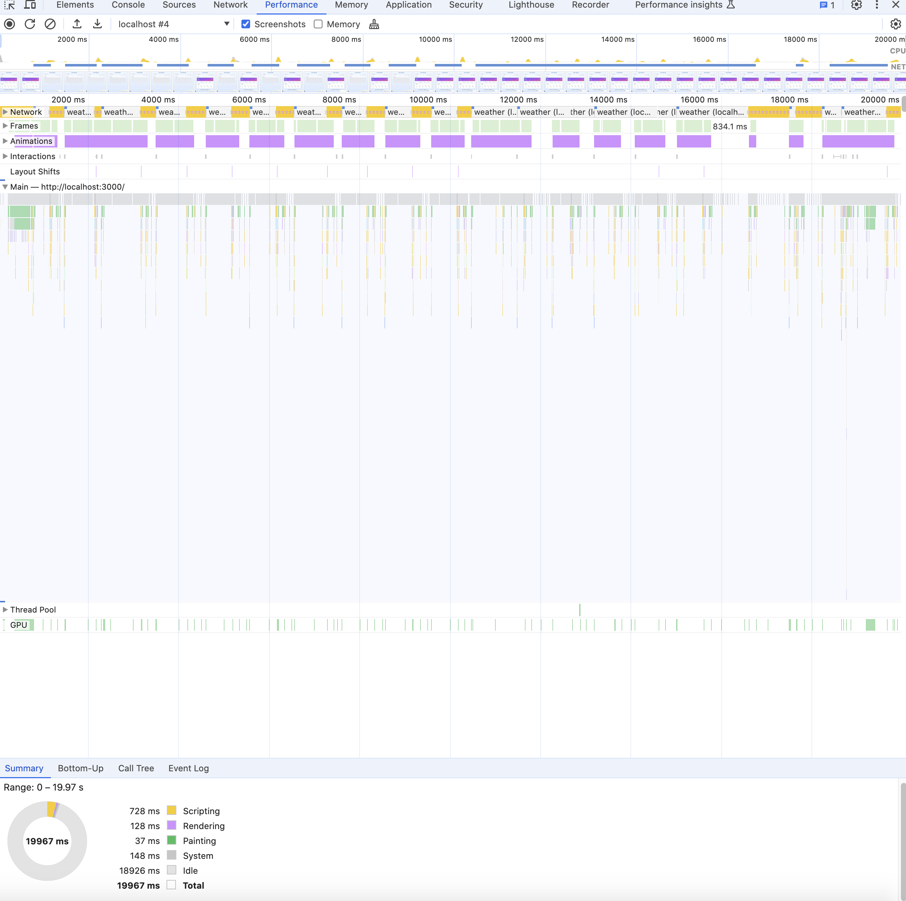
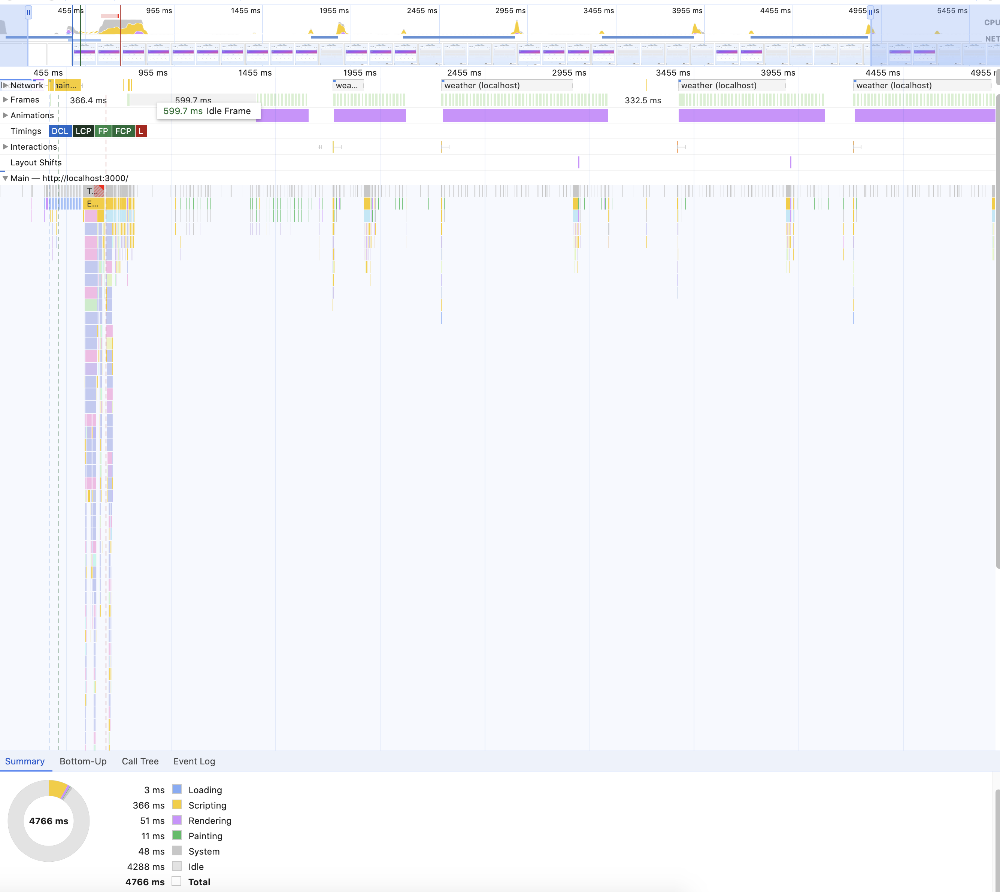

# Weather Application

A modern weather application built with Next.js, featuring real-time weather data, location search, and Redis caching.

## Quick Start

1. Make sure you have Docker and Docker Compose installed:
```bash
docker --version
docker-compose --version
```

2. Clone the repository:
```bash
git clone git@github.com:salaheddinebellafrouh/simple-weather-app.git
cd simple-weather-app
```

3. Start the application:
```bash
docker-compose up --build
```

The application will be available at http://localhost:3000

## Architecture Summary

### Component Interaction Flow

```
┌─────────────┐     ┌─────────────┐     ┌─────────────┐
│   Next.js   │     │    Redis    │     │  OpenWeather│
│   Frontend  │     │    Cache    │     │    API      │
└──────┬──────┘     └──────┬──────┘     └──────┬──────┘
       │                   │                   │
       │ 1. User selects  │                   │
       │    location      │                   │
       │─────────────────>│                   │
       │                   │                   │
       │ 2. Check cache   │                   │
       │─────────────────>│                   │
       │                   │                   │
       │ 3. Cache miss    │                   │
       │<─────────────────│                   │
       │                   │                   │
       │ 4. Fetch data    │                   │
       │──────────────────────────────────────>│
       │                   │                   │
       │ 5. API response  │                   │
       │<──────────────────────────────────────│
       │                   │                   │
       │ 6. Store in cache│                   │
       │─────────────────>│                   │
       │                   │                   │
       │ 7. Update UI     │                   │
       │<─────────────────│                   │
```

### Key Components and Their Roles

1. **Frontend Layer (`app/` and `components/`)**
   - `page.tsx`: Main application page
   - `WeatherContainer`: Manages weather data state and location selection
   - `WeatherDisplay`: Renders weather information
   - `LocationSearch`: Handles location selection UI
   - `RedisToggle`: Controls Redis caching state

2. **API Layer (`app/api/`)**
   - `/api/weather/route.ts`: Handles weather data requests
   - `/api/location/route.ts`: Manages location data
   - `/api/cache/toggle/route.ts`: Controls Redis caching

3. **Service Layer (`lib/`)**
   - `weather-service.ts`: Core weather data fetching logic
   - `redis.ts`: Redis caching implementation
   - `redis-state.ts`: Redis state management

### Data Flow Details

1. **Location Selection Flow**
   ```
   User → LocationSearch → WeatherContainer → API Route → Weather Service → Redis Cache
   ```

2. **Weather Data Flow**
   ```
   WeatherContainer → API Route → Weather Service → Redis Cache → OpenWeather API
   ```

3. **Caching Flow**
   ```
   Request → Redis Check → Cache Hit/Miss → API Call (if miss) → Cache Update → Response
   ```

### State Management

1. **Client-Side State**
   - Weather data
   - Selected location
   - Loading states
   - Error states

2. **Server-Side State**
   - Redis cache
   - API response caching
   - Location data caching

### Error Handling

1. **Client-Side**
   - Loading states
   - Error messages
   - Fallback UI

2. **Server-Side**
   - API error handling
   - Cache fallbacks
   - Rate limiting

### Performance Optimizations

1. **Caching Strategy**
   - Weather data: 30-minute TTL
   - Location data: 24-hour TTL
   - Automatic cache invalidation

2. **Data Fetching**
   - Parallel requests
   - Error retries
   - Cache-first approach

## Scaling Strategy

This application can scale to millions of daily users through a combination of frontend and backend optimizations. On the frontend, we would deploy the Next.js application across multiple global regions using CDNs like Vercel or Cloudflare, implement static generation for common locations, and leverage edge caching for API responses. This approach minimizes latency and ensures fast page loads regardless of user location.

For backend scalability, we would transition to a microservices architecture with dedicated Weather, Location, and Cache services deployed on Kubernetes for horizontal scaling. The data layer would utilize Redis Cluster with Sentinel for high availability, while load balancers, auto-scaling groups, and multi-region deployment would ensure the infrastructure can handle traffic spikes. Comprehensive monitoring and rate limiting would protect against potential system overloads and attacks.

## Troubleshooting

1. **Build Issues**
   - Clear Docker cache: `docker-compose build --no-cache`
   - Rebuild: `docker-compose up --build`

2. **Weather API Issues**
   - Verify API key in environment variables
   - Check API rate limits
   - Monitor error logs

3. **Container Status**
   - Check running containers: `docker-compose ps`
   - View logs: `docker-compose logs`
   - Restart services: `docker-compose restart` 

## API Performance Benchmark

### 🧪 Testing Methodology

- Tool: **Chrome DevTools** → *Network tab*
- Scenario: Fetched `/api/weather?lat=51.5074&lon=-0.1278` multiple times
- Comparison between performance **with** and **without** Redis caching
- Each value below is an average of 3–4 identical API calls

---

### 📊 Results

| API Endpoint    | Response Time (No Cache) | Response Time (With Redis) | Improvement    |
|-----------------|--------------------------|-----------------------------|----------------|
| `/api/weather`  | ~314 ms                  | ~13 ms                      | ~95.8% faster  |

Redis caching significantly reduced response times from ~300ms to ~13ms on repeated calls.

---

### 🔍 Screenshots

#### Without Redis:


#### With Redis:


## Performance Analysis

Performance testing conducted with Chrome DevTools shows significant improvements after implementing Redis caching:

### Key Metrics Comparison

| Metric | Before Optimization | After Optimization | Improvement |
|--------|---------------------|-------------------|------------|
| Total Duration | 19.97s | 4.77s | 76% reduction |
| Script Processing | 728ms | 366ms | 50% reduction |
| Rendering | 128ms | 51ms | 60% reduction |
| API Response Time | ~314ms | ~13ms | 96% faster |

### Performance Screenshots

#### Before Optimization:


#### After Optimization:


The implementation of Redis caching dramatically improved application responsiveness, with API response times reduced by ~96% on subsequent requests. Users experience significantly faster data loading and more responsive interactions throughout the application.